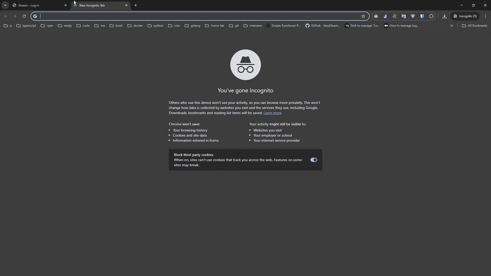
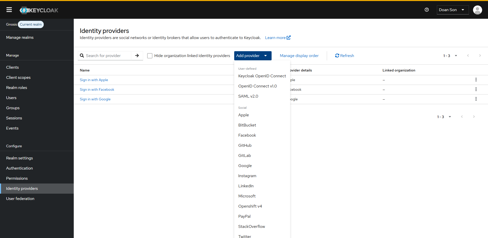

# 
# 

# 🔐 Keycloak: Google & Apple Identity Provider Integration

This project demonstrates how to integrate Google Sign-In and Apple Sign-In into Keycloak, both locally and in Docker, using the [Apple Identity Provider for Keycloak](https://github.com/klausbetz/apple-identity-provider-keycloak).

---

## 📋 Table of Contents
- [Overview](#overview)  
- [Prerequisites](#prerequisites)  
- [Google Integration](#google-integration)  
- [Apple Integration](#apple-integration)  
---
## 🎯 Overview

Keycloak can act as a broker for external IdPs. This guide shows you how to:

1. Configure Google as an external identity provider.  
2. Configure Apple using the community plugin `klausbetz/apple-identity-provider-keycloak`.  
3. Launch Keycloak (with both providers) via Docker.

---

## ⚙️ Prerequisites
- Docker & Docker Compose (for containerized setup)  
- A Google Cloud project with OAuth 2.0 credentials  
- An Apple Developer account & Service ID for “Sign in with Apple”

---

## ✅ Google Integration

1. In the [Google Cloud Console](https://console.cloud.google.com/apis/credentials), create an OAuth 2.0 Client ID.  
2. Note your **Client ID** and **Client Secret**.  
3. In Keycloak Admin Console → **Identity Providers** → **Add provider** → **Google**:  
   - **Client ID**: _your-google-client-id_  
   - **Client Secret**: _your-google-client-secret_  
   - **Default Scopes**: `openid email profile`  
4. Save and test “Google” on your login page.

---

## ✅ Apple Integration

We use the community plugin maintained here:

> 🔗 https://github.com/klausbetz/apple-identity-provider-keycloak

### Build & Install

```bash
cd keycloak-providers
git clone https://github.com/klausbetz/apple-identity-provider-keycloak.git
docker compose up -d